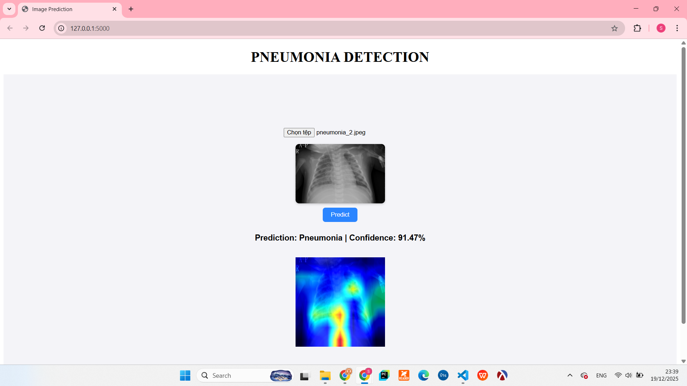
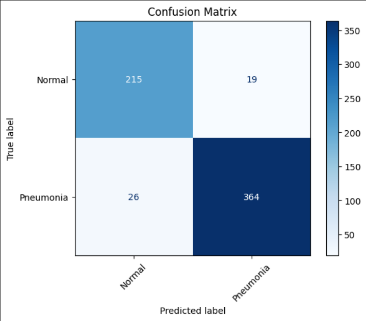
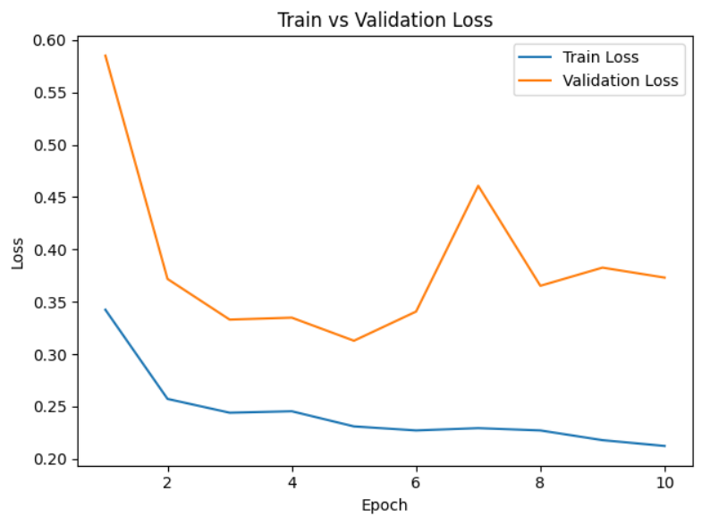

# PNEUMONIA PREDICTION

Binary classification through X-ray captures.

### Demo:


## Description

Pneumonia is a lung disease that just can be diagnosed effectively through chest X-rays and blood tests.
This model helps improve the accuracy of diagnosis through images.


## Table of Contents

- [Installation](#installation)
- [Usage](#usage)
- [Dataset](#dataset)
- [Model Architecture](#model-architecture)
- [Training](#training)
- [Results](#results)
- [Requirements](#requirements)
- [Contributing](#contributing)
- [License](#license)

## Installation

### Prerequisites

- Python 3.8+
- pip or conda

### Setup

1. Clone the repository
```bash
git clone https://github.com/trongson1106/Pneumonia_Prediction
cd your-project
```

2. Install dependencies
```bash
pip install -r requirements.txt
```

## Usage


```bash
python app.py
```
The directory called _models_ will be created to store the model.
Then there should be a link http://127.0.0.1:5000, click to try predicting.

## Dataset

**Dataset Name:** Chest X-ray Images (Pneumonia)
- **Link to dataset:** https://www.kaggle.com/datasets/paultimothymooney/chest-xray-pneumonia

- **Classes:** 2 classes (NORMAL and PNEUMONIA)
- **Training Images:** 1341 images of NORMAL, 3875 images of PNEUMONIA
- **Validation Images:** 234 images of NORMAL, 390 images of PNEUMONIA
- **Test Images:** 8 images each class

**Data Preprocessing:**
- Image resizing to 224x224
- Normalization with mean=[0.485, 0.456, 0.406], std=[0.229, 0.224, 0.225]
- Data augmentation: Horizontal flip, Blur,... to simulate patients' motion in capturing process.

## Model Architecture

**Base Model:** ResNet50

**Architecture Details:**
- Input size: (1, 3, 224, 224) corresponding (B, C, W, H)
- Number of layers: 50 layers (including fully-connected layers)
- Total parameters: 25.6 million

**Modifications:**
- Replace the last FC by one Linear layer with the output is 2.

## Training

**Hyperparameters:**
- Optimizer: Adam
- Learning Rate: 1e-4
- Weight decay: 1e-4
- Batch Size: 32
- Epochs: 25
- Loss Function: CrossEntropyLoss

**Training Strategy:**
- Transfer learning from ImageNet weights
- Learning rate scheduling: ReduceLROnPlateau
- Early stopping with patience=5

## Results


### Confusion Matrix



### Training Curves



## Requirements

```
torch
torchvision
flask
pillow
huggingface_hub
matplotlib
scikit-learn
```

## Project Structure

```
project-name/
├── images
├── models/
│   └── best_resnet50_model_updated.pth
│   
├── notebooks/
│   ├── pnuemonia_resnet50.ipynb
│   └── pneumonia_resnet50_updated.ipynb
│
├── static
│   └── style.css
│
├── templates
│   └── index.html
│
├── app.py
├── functions.py
├── requirements.txt
└── README.md
```

## Future Work

- [ ] Implement additional architectures (EfficientNet, Vision Transformer)

## License

This project is licensed under the MIT License - see the [LICENSE](LICENSE) file for details.

## Acknowledgments

- Dataset source: https://www.kaggle.com/datasets/paultimothymooney/chest-xray-pneumonia
- Built with PyTorch and torchvision

## Contact

Trong Son Hoang - sonh29267@gmail.com

Project Link: [https://github.com/trongson1106/Pneumonia_Prediction](https://github.com/trongson1106/pneumonia_prediction)
